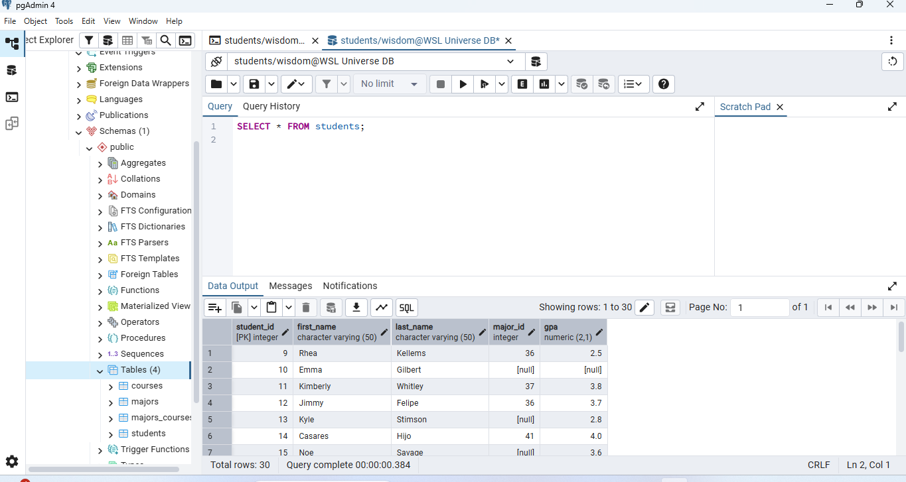

# 🎓 Student Database — PostgreSQL + Bash ETL

**A Bash script that turns messy CSV files into a clean, normalized, production-style database — zero manual entry, zero duplicate data, zero orphaned records.**

## Proof

30 students. 7 majors. Correctly linked. NULLs handled properly, not faked.

## What It Does

CSV → validate → dedupe → load into a normalized 4-table PostgreSQL schema, enforced by foreign keys the database itself won't let you break.
