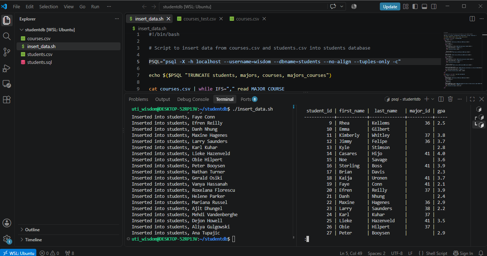

# 🎓 Student Database — PostgreSQL + Bash ETL


**A Bash script that turns messy CSV files into a clean, normalized, production-style database — zero manual entry, zero duplicate data, zero orphaned records.**

## Proof

30 students. 7 majors. Correctly linked. NULLs handled properly, not faked.




## What It Does

CSV → validate → dedupe → load into a normalized 4-table PostgreSQL schema, enforced by foreign keys the database itself won't let you break.

```
majors ──1:N──► students
majors ──N:M──► majors_courses ◄──N:M── courses
```

**Tables:**

| Table | Purpose |
|---|---|
| `students` | Student name, major, GPA |
| `majors` | Unique list of academic majors |
| `courses` | Unique list of courses offered |
| `majors_courses` | Junction table linking majors to courses (many-to-many) |

## Why It's More Than a Class Project

This is the exact pattern behind real ETL pipelines:
- **FinTech:** transactions can't exist without a valid account
- **HealthTech:** prescriptions can't exist without a valid patient
- **E-commerce:** order items can't exist without a valid order

Foreign keys make bad data structurally impossible — not just discouraged.

## How to Set Up and Run It

**Prerequisites:**
- PostgreSQL installed and running
- A PostgreSQL user with permission to create databases

**1. Clone the repo**

git clone https://github.com/utiwisdom/student-database-postgresql-bash.git
cd student-database-postgresql-bash

**2. Create the database**

psql -U your_username -d postgres -h localhost

Then inside psql:

CREATE DATABASE students;
\c students

**3. Create the tables** (run inside psql, connected to `students`)

CREATE TABLE majors (
  major_id SERIAL PRIMARY KEY,
  major VARCHAR(50) UNIQUE NOT NULL
);

CREATE TABLE courses (
  course_id SERIAL PRIMARY KEY,
  course VARCHAR(50) UNIQUE NOT NULL
);

CREATE TABLE majors_courses (
  major_id INT REFERENCES majors(major_id),
  course_id INT REFERENCES courses(course_id),
  PRIMARY KEY (major_id, course_id)
);

CREATE TABLE students (
  student_id SERIAL PRIMARY KEY,
  first_name VARCHAR(50) NOT NULL,
  last_name VARCHAR(50) NOT NULL,
  major_id INT REFERENCES majors(major_id),
  gpa NUMERIC(3,2)
);

Exit psql with `\q`.

**4. Make the script executable and run it**

chmod +x insert_data.sh
./insert_data.sh

The script reads `courses.csv` and `students.csv` in the same folder, dedupes majors/courses as it goes, and inserts everything with the correct foreign key links.

**Or skip all of the above and rebuild directly from the dump:**

psql -U your_username -f students.sql

## Sample Queries

**Students with their major:**

SELECT s.first_name, s.last_name, m.major, s.gpa
FROM students s
LEFT JOIN majors m ON s.major_id = m.major_id
ORDER BY s.last_name;

**Courses for a given major:**

SELECT c.course
FROM courses c
JOIN majors_courses mc ON c.course_id = mc.course_id
JOIN majors m ON mc.major_id = m.major_id
WHERE m.major = 'Database Administration';

**Students per major:**

SELECT m.major, COUNT(s.student_id) AS student_count
FROM majors m
LEFT JOIN students s ON m.major_id = s.major_id
GROUP BY m.major
ORDER BY student_count DESC;

## Stack

PostgreSQL · Bash · SQL · pg_dump · CSV parsing

## Skills Demonstrated

Normalization (3NF) · Foreign & composite keys · Bash scripting (loops, conditionals, subshells) · NULL handling · Idempotent script design · Referential data integrity

## Author

**Wisdom Oghenevwede Uti** — Aspiring Data Engineer · ALX Data Engineering Graduate · Secondary School Teacher · ALX Volunteer Mentor

[LinkedIn](https://www.linkedin.com/in/uti-wisdom-286602228/) · [GitHub](https://github.com/utiwisdom) · [Portfolio](https://datascienceportfol.io/wisdomuti8)

---
Built as part of the freeCodeCamp Relational Database Certification. MIT License.
